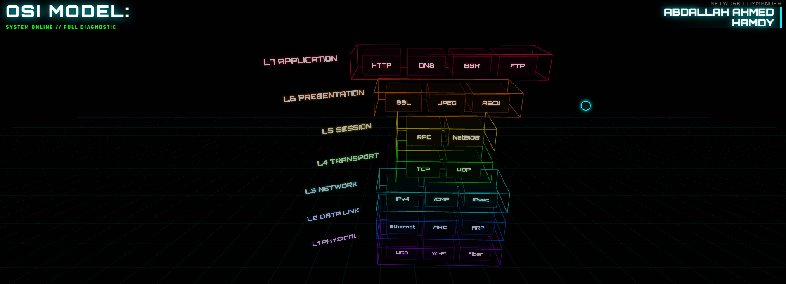

<h1>Interactive OSI Model</h1>

  

🚀 Interactive educational website for learning and visualizing the OSI (Open Systems Interconnection) Model.
Overview

The OSI Model is one of the first networking concepts students encounter, but many learners find it difficult to visualize and remember the relationship between the seven layers.

This project was built to provide an interactive and beginner-friendly way to explore the OSI Model and understand the purpose of each layer.

Features
Interactive layer navigation
Layer-by-layer explanations
Clean visual design
Responsive interface
Networking-focused educational content
What I Learned

While building this project, I improved my understanding of:

OSI Model
Networking Fundamentals
User Interface Design
Front-End Development Workflow
Iterative Development Process
AI-Assisted Development
Development Notes

This project was developed through multiple iterations and refinements.

I used Google AI Studio as a development assistant while continuously testing, fixing issues, refining interactions, improving the visual design, and adjusting the user experience until reaching the current version.

The final result reflects multiple development cycles rather than a single generated output.

Technologies
HTML
CSS
JavaScript
Google AI Studio
Vercel
Future Improvements
Protocol examples for each layer
Packet flow visualization
Interactive networking quizzes
TCP/IP model comparison
Author

Abdallah Hamdy

Business Administration Student | Networking & Cybersecurity | CCNA Candidate | Reverse Engineering & Malware Analysis Learner
